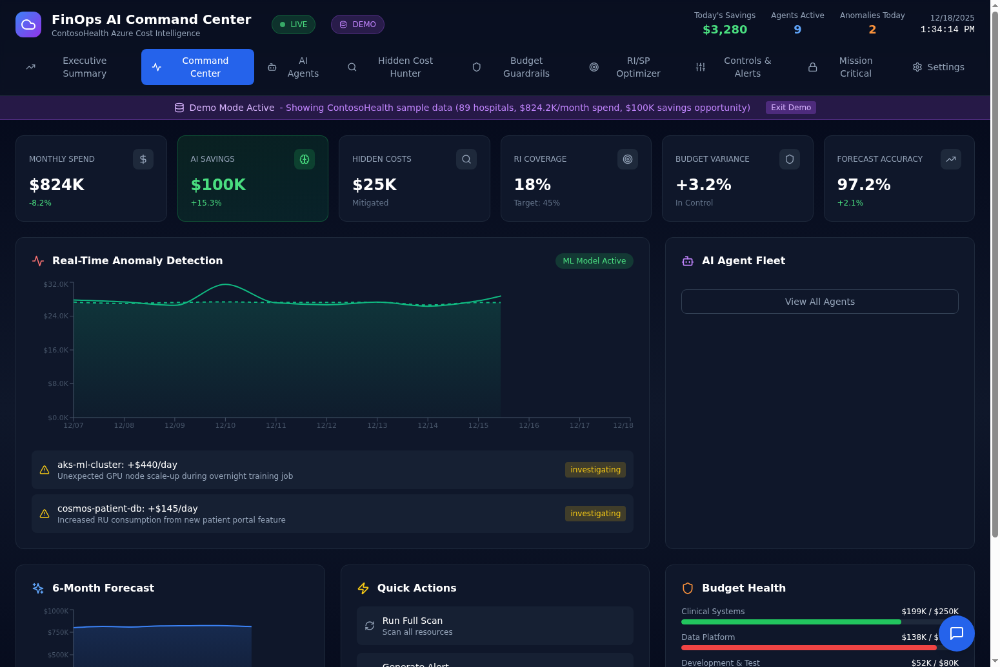
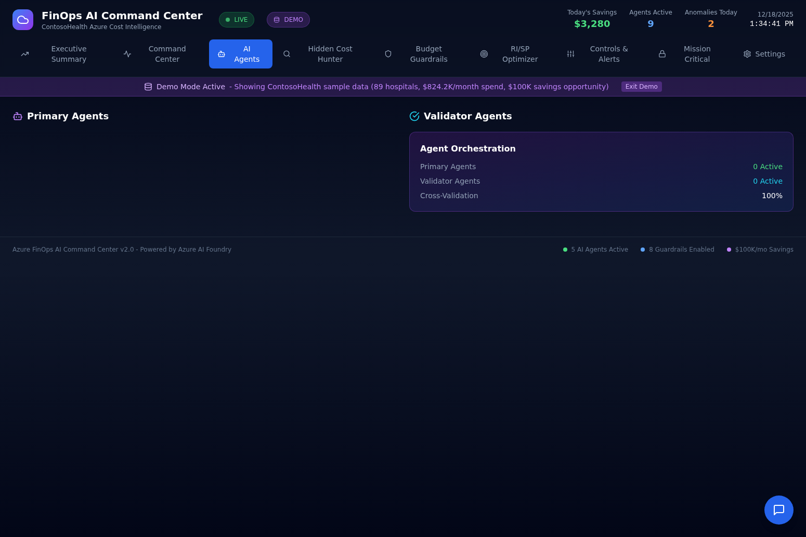
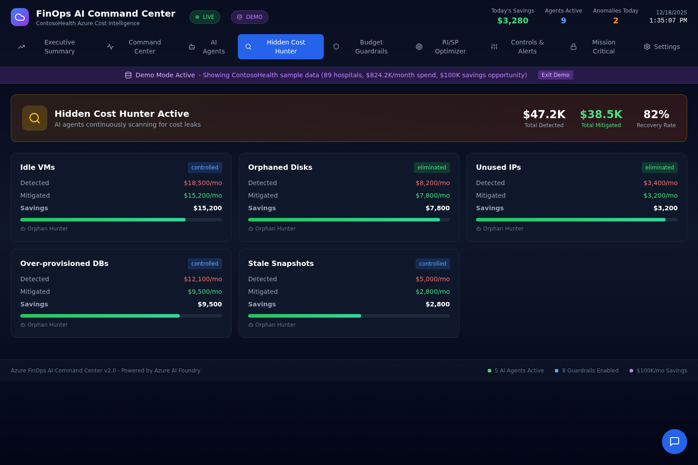
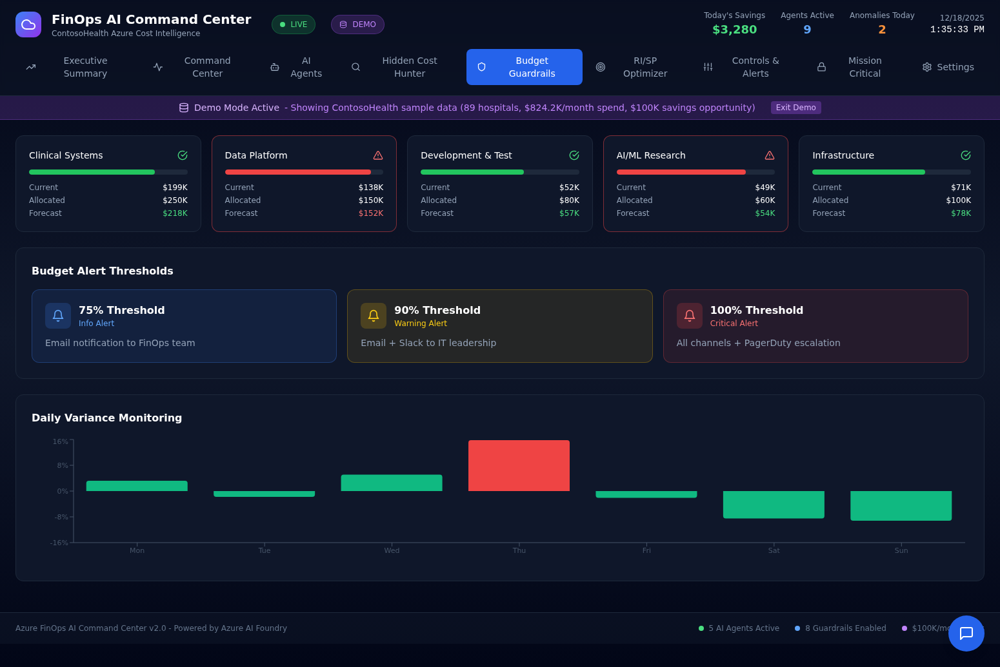
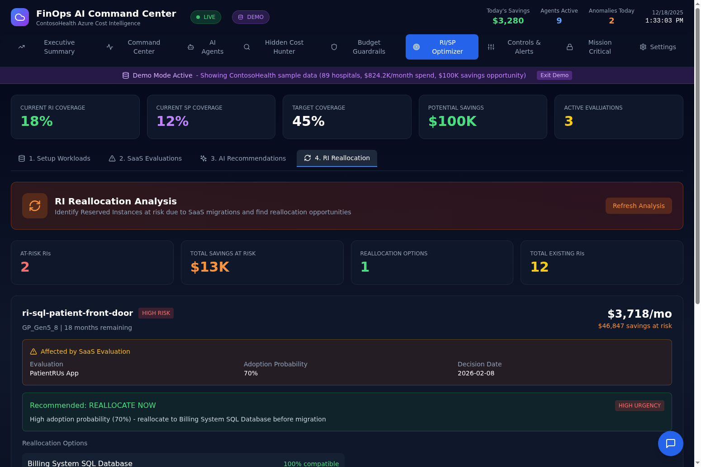
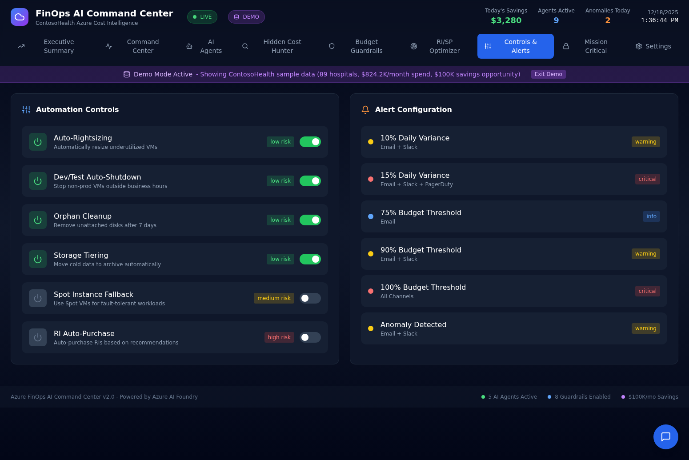
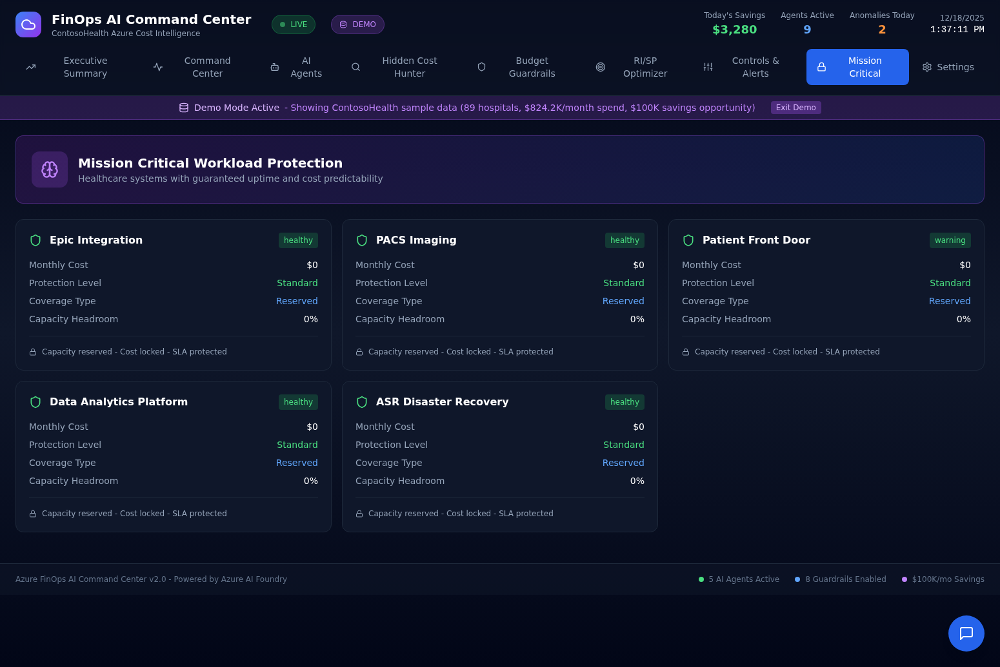

# Azure FinOps AI Command Center

An AI-powered Azure FinOps dashboard that automates cost optimization, RI/SP commitment decisions, and anomaly detection using a multi-agent ensemble architecture.

> **Disclaimer**: ContosoHealth is a **fictitious healthcare provider** used for demonstration purposes only. All data, scenarios, and financial figures shown in demo mode are simulated and do not represent any real organization.

---

## Business Value

### Acknowledgments

This project builds upon the excellent work of the **Azure Product Group** and their APIs for Azure Recommendations and Cost Optimization. Special thanks to the PG team for providing the foundational APIs that make intelligent cost management possible:

- **Azure Cost Management APIs** - Real-time cost data, budgets, and forecasting
- **Azure Advisor APIs** - RI/SP recommendations, right-sizing suggestions, and best practices
- **Azure Resource Graph** - Resource discovery and inventory management
- **Azure Consumption APIs** - Usage details and reservation utilization

### The Challenge

Organizations using Azure face a critical challenge: Reserved Instances (RI) and Savings Plans (SP) can reduce compute costs by **33-56%**, but making the wrong commitment decision can lock you into unused capacity for 1-3 years. Traditional approaches rely on spreadsheets and manual analysis, leading to:

- Missed savings opportunities worth tens of thousands per month
- Commitments made on workloads about to migrate to SaaS
- No visibility into technology evaluations affecting commitment decisions
- Reactive rather than proactive cost management

### The Solution

This FinOps AI Command Center provides **supplemental value** on top of Azure's native capabilities by introducing an **agentic framework** that addresses the growing complexity of SaaS proliferation and AI agent adoption in enterprise environments. Key differentiators include:

**Intelligent SaaS Evaluation Tracking** - Before committing to a 3-year RI on SQL Server, the system automatically checks if you're evaluating PatientRUs, Snowflake, or other SaaS solutions that might replace that workload. Commitments are automatically placed on HOLD until decisions are made.

**Multi-Agent Ensemble Architecture** - Five specialized AI agents (Cost Sentinel, Commitment Advisor, Orphan Hunter, Right-Size Engine, SaaS Evaluator) cross-validate recommendations to ensure accuracy and reduce false positives.

**Human-in-the-Loop Governance** - Every recommendation requires explicit approval. Upload contracts, vendor proposals, or technical assessments and re-run AI analysis with new context before making decisions.

**RI Reallocation Analysis** - When workloads are being evaluated for SaaS migration, the system identifies existing Reserved Instances at risk and recommends reallocation options to preserve savings.

### Why This Matters

This project was created as a **personal value-add exploration** into how agentic frameworks can provide additional intelligence in the world of SaaS and Agent proliferation. As organizations increasingly adopt SaaS solutions and AI agents, the complexity of cost optimization decisions grows exponentially. This dashboard demonstrates how AI agents can:

1. Cross-reference multiple data sources (Azure costs, SaaS evaluations, workload context)
2. Provide risk-aware recommendations that consider business context
3. Enable human oversight while automating routine analysis
4. Adapt to changing technology landscapes

---

## Feature Walkthrough

### Executive Summary

The Executive Summary provides a real-time view of your Azure FinOps posture with key metrics at a glance.


The dashboard displays monthly Azure cost ($824K in demo mode), monthly savings achieved ($100K), anomaly resolution status (4/6 resolved), budget status with warnings, RI coverage (18% vs 45% target), and agent savings from 5+ active AI agents. The Anomaly Resolution Timeline shows active investigations and resolved issues with cost impact. Budget Guardrails display spending by department with progress bars. The RI/SP Recommendation Actions card tracks approved, held, and blocked recommendations with approval rate.

### Command Center

The Command Center provides operational visibility into real-time cost monitoring and AI agent activity.



Real-Time Anomaly Detection uses ML models to identify cost spikes with automatic investigation. The 6-Month Forecast chart shows projected spending trends. Quick Actions enable full resource scans, demo alerts, and RI purchase workflows. Budget Health displays department-level spending with visual progress indicators.

### AI Agents

The AI Agents tab shows the multi-agent ensemble architecture powering the dashboard.



Primary Agents include Cost Sentinel (anomaly detection), Commitment Advisor (RI/SP optimization), and Orphan Hunter (unused resource identification). Validator Agents cross-check recommendations for accuracy. The Agent Orchestration panel shows active agent counts and cross-validation status.

### Hidden Cost Hunter

The Hidden Cost Hunter identifies and mitigates cost leaks across your Azure environment.



Categories tracked include Idle VMs ($18,500/mo detected, $15,200/mo mitigated), Orphaned Disks ($8,200/mo detected, $7,800/mo mitigated), Unused IPs ($3,400/mo detected, $3,200/mo mitigated), Over-provisioned DBs ($12,100/mo detected, $9,500/mo mitigated), and Stale Snapshots ($5,000/mo detected, $2,800/mo mitigated). Total recovery rate is 82% with $47.2K detected and $38.5K mitigated.

### Budget Guardrails

Budget Guardrails provide proactive budget monitoring with configurable alert thresholds.



Department budgets show current spend, allocated budget, and forecast with visual indicators. Clinical Systems shows $199K current vs $250K allocated with $218K forecast. Alert thresholds are configurable at 75% (info), 90% (warning), and 100% (critical) with escalation to Email, Slack, and PagerDuty. Daily Variance Monitoring chart shows spending patterns throughout the week.

### RI/SP Optimizer

The RI/SP Optimizer is the core decision-making interface for Reserved Instance and Savings Plan commitments.


Coverage metrics show current RI coverage (18%), SP coverage (12%), target coverage (45%), potential savings ($100K), and active evaluations (3). The four-tab workflow includes Setup Workloads (map business applications to Azure resources), SaaS Evaluations (track technology evaluations affecting commitments), AI Recommendations (review and approve/hold/block recommendations), and RI Reallocation (identify at-risk RIs and reallocation options).

### RI Reallocation Analysis

The RI Reallocation Analysis feature identifies Reserved Instances at risk due to SaaS migrations and recommends reallocation options.



Summary metrics show at-risk RIs (2), total savings at risk ($13K), reallocation options available (1), and total existing RIs (12). Each at-risk RI displays the reservation name, SKU, remaining term, monthly cost, and savings at risk. The Affected by SaaS Evaluation section shows which evaluation is causing the risk, adoption probability, and decision date. Recommended actions include REALLOCATE NOW, EXCHANGE OR REFUND, MONITOR AND PREPARE, or WAIT FOR DECISION with urgency levels. Reallocation Options show compatible workloads with compatibility scores.

### Controls & Alerts

The Controls & Alerts tab configures automation controls and alert thresholds.



Automation Controls include Auto-Rightsizing (low risk), Dev/Test Auto-Shutdown (low risk), Orphan Cleanup (low risk), Storage Tiering (low risk), Spot Instance Fallback (medium risk), and RI Auto-Purchase (high risk). Each control has a toggle and risk indicator. Alert Configuration shows thresholds for daily variance (10%, 15%), budget thresholds (75%, 90%, 100%), and anomaly detection with notification channels.

### Mission Critical

The Mission Critical tab protects healthcare systems with guaranteed uptime and cost predictability.



Protected workloads include Epic Integration (healthy), PACS Imaging (healthy), Patient Front Door (warning due to SaaS evaluation), Data Analytics Platform (healthy), and ASR Disaster Recovery (healthy). Each workload shows monthly cost, protection level, coverage type, and capacity headroom with SLA protection status.

### Settings

The Settings tab configures Azure connection, automation controls, and discount settings.


Azure Connection shows tenant configuration status with Tenant ID, Client ID, and Subscription ID. Discovery Results display scanned resources. Manual Data Import allows pasting Azure Advisor CSV exports when live API access is blocked. Automation Controls configure auto-shutdown schedules, RI purchase automation, orphan cleanup, right-sizing, budget alerts, and circuit breakers. RI/SP Discount Settings configure EA discount (12%), RI 1-Year (36%), RI 3-Year (56%), SP 1-Year (33%), and SP 3-Year (52%) discounts.

---

## Installation Guide (Addendum)

### Prerequisites

- Python 3.11+ with Poetry
- Node.js 18+ with npm
- Azure subscription (optional - demo mode available)
- Azure OpenAI resource (for AI agent functionality)

### Step 1: Clone the Repository

```bash
git clone https://github.com/gregnatkatz/finops.git
cd finops
```

### Step 2: Install Backend Dependencies

```bash
cd finops-backend
poetry install
```

### Step 3: Configure Environment Variables

```bash
cp .env.example .env
```

Edit `.env` with your configuration:

```env
# Required: Azure OpenAI for AI agents
AZURE_OPENAI_ENDPOINT=https://your-resource.openai.azure.com/
AZURE_OPENAI_API_KEY=your-api-key
AZURE_OPENAI_DEPLOYMENT=gpt-4

# Optional: Azure credentials for live data
AZURE_TENANT_ID=your-tenant-id
AZURE_CLIENT_ID=your-client-id
AZURE_CLIENT_SECRET=your-client-secret
AZURE_SUBSCRIPTION_ID=your-subscription-id
```

### Step 4: Install Frontend Dependencies

```bash
cd ../finops-frontend
npm install
```

### Step 5: Start the Backend Server

```bash
cd ../finops-backend
poetry run uvicorn app.main:app --host 0.0.0.0 --port 8000 --reload
```

### Step 6: Start the Frontend Development Server

In a new terminal:

```bash
cd finops-frontend
npm run dev
```

### Step 7: Access the Dashboard

Open http://localhost:5173 in your browser. The dashboard runs in demo mode with simulated ContosoHealth data (89 hospitals, $824.2K/month spend, $100K savings opportunity) until you connect Azure credentials.

### Connecting to Azure (Optional)

To use live Azure data instead of demo mode:

1. Create an App Registration in Azure AD
2. Grant Cost Management Reader and Reader roles on your subscription
3. Enter credentials in Settings > Azure Connection
4. Click "Connect to Azure"

The mode indicator changes from "DEMO" to "LIVE" when connected.

### Conditional Access Workaround

If your organization blocks service principals with Conditional Access:

1. Export recommendations from Azure Portal > Advisor > Download as CSV
2. Go to Settings > Manual Data Import
3. Paste the CSV content
4. AI agents will analyze the imported data

---

## Technology Stack

- **Frontend**: React 18, TypeScript, Tailwind CSS, Recharts, Lucide Icons
- **Backend**: FastAPI, SQLite, SQLAlchemy, APScheduler
- **AI**: Azure OpenAI (GPT-5, O3, O4-Mini, GPT-4.1)
- **Azure SDKs**: azure-mgmt-costmanagement, azure-mgmt-advisor, azure-mgmt-consumption

---

## API Reference

### Core Endpoints

| Endpoint | Method | Description |
|----------|--------|-------------|
| `/api/stats` | GET | Dashboard statistics |
| `/api/recommendations` | GET | RI/SP recommendations |
| `/api/risp-actions` | GET | Approve/hold/block summary |
| `/api/risp-actions/{action}` | POST | Record a decision |
| `/api/reallocation/opportunities` | GET | RI reallocation analysis |

### Azure Integration

| Endpoint | Method | Description |
|----------|--------|-------------|
| `/api/azure/health` | GET | Connection status |
| `/api/azure/costs/daily` | GET | Daily cost breakdown |
| `/api/discovery` | POST | Run resource discovery |

### Workload Intelligence

| Endpoint | Method | Description |
|----------|--------|-------------|
| `/api/workloads` | GET/POST | Workload registry |
| `/api/evaluations` | GET/POST | SaaS evaluations |
| `/api/evaluations/{id}/analyze` | POST | Run AI analysis |

---

## Open Source

This project is released as open source under the MIT License. It is provided **as-is** without warranty.

Special thanks again to the **Azure Product Group** for their excellent APIs and documentation that made this project possible.

---

## Author

Created by Greg Katz as a personal project exploring agentic frameworks for FinOps.
