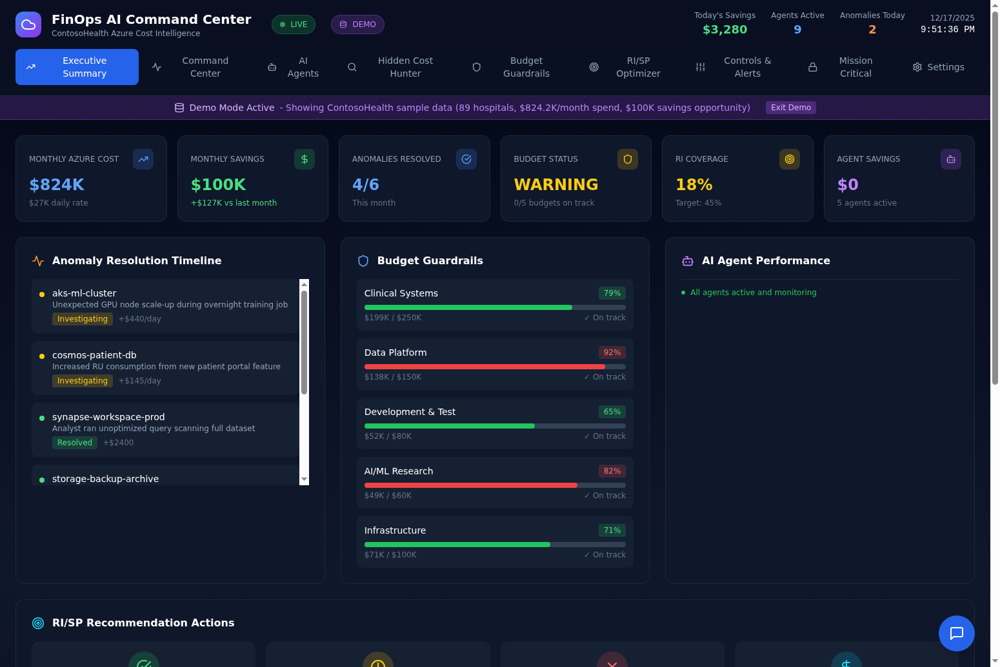
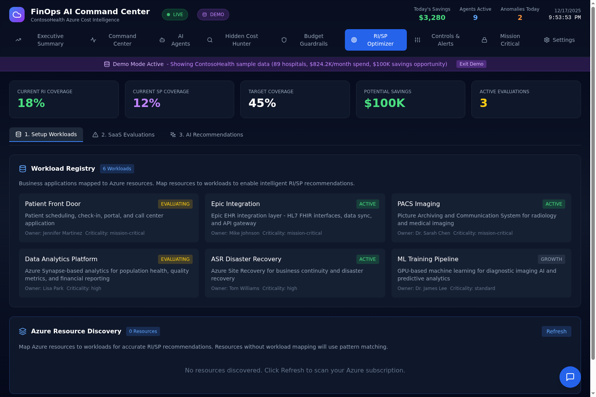
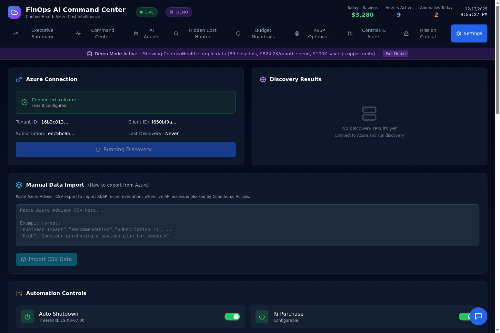

# FinOps AI Command Center

An AI-powered Azure FinOps dashboard that automates cost optimization, RI/SP commitment decisions, and anomaly detection using a multi-agent ensemble (GPT-5, O3, O4-Mini, GPT-4.1).

## Demo Video

Watch the complete walkthrough demonstrating the RI/SP decision workflow, SaaS evaluation tracking, document upload, and human-in-the-loop governance:

[](https://github.com/gregnatkatz/finops/raw/mainbr/video_assets/finops_demo.mp4)

**[Download Full Demo Video](https://github.com/gregnatkatz/finops/raw/mainbr/video_assets/finops_demo.mp4)**

The demo showcases a real healthcare scenario: ContosoHealth's Patient Front Door application (SQL Server + Windows VMs) being evaluated against PatientRUs App, a call center SaaS solution with 70% adoption probability.

## Why RI/SP Optimization Matters

Reserved Instances (RI) and Savings Plans (SP) can reduce Azure compute costs by 33-56%, but making the wrong commitment decision can lock you into unused capacity for 1-3 years. This dashboard solves that problem by:

1. **AI-Powered Risk Assessment** - Multi-agent ensemble analyzes workload stability, growth patterns, and technology evaluations before recommending commitments
2. **SaaS Evaluation Tracking** - Automatically HOLD commitments when you're evaluating Snowflake, Databricks, PatientRUs, or other SaaS that might replace Azure workloads
3. **Human-in-the-Loop Governance** - Approve, Hold, or Block each recommendation with full audit trail
4. **Document Upload & Re-Analysis** - Upload contracts, vendor proposals, or technical assessments and re-run AI analysis with new context
5. **Dynamic Pricing** - Configure your EA discount and see real-time RI/SP price calculations
6. **Workload Registry** - Map business applications to Azure resources for intelligent commitment decisions

## Key Features

### Executive Summary Dashboard

The Executive Summary provides a real-time view of your Azure FinOps posture:



- **Monthly Azure Cost**: $824K with daily rate tracking
- **Monthly Savings**: $100K with month-over-month comparison
- **Anomalies Resolved**: 4/6 this month with resolution timeline
- **Budget Status**: WARNING with budget monitoring
- **RI Coverage**: 18% current vs 45% target
- **Agent Savings**: Real-time tracking from 5+ active AI agents

The **RI/SP Recommendation Actions** card tracks all your commitment decisions:
- Approved count with total approved savings
- Items on hold pending evaluation
- Blocked recommendations
- Approval rate percentage

### RI/SP Optimizer

The RI/SP Optimizer is the core decision-making interface:



**Coverage Metrics**
- Current RI Coverage: 18%
- Current SP Coverage: 12%
- Target Coverage: 45%
- Potential Savings: $100K
- Active Evaluations: 3

**Upcoming SaaS / Technology Evaluations**

Track technology evaluations that may replace Azure workloads. The system automatically HOLDs commitments for affected resources until decisions are made.

| Evaluation | Vendor | Workload | Status | Decision Date | Adoption Risk | Holding |
|------------|--------|----------|--------|---------------|---------------|---------|
| PatientRUs App | PatientRUs Inc. | Patient Front Door | POC | 2026-02-08 | 70% | HOLDING |
| Snowflake Enterprise | Snowflake | Data Analytics Platform | POC | 2026-03-10 | 65% | HOLDING |
| Databricks Unity Catalog | Databricks | Data Analytics Platform | EVALUATING | 2026-04-09 | 45% | HOLDING |
| Google Cloud Healthcare API | Google Cloud | PACS Imaging | EVALUATING | 2026-06-08 | 25% | No |

**AI-Powered Commitment Recommendations**

Each recommendation shows:
- Resource name and workload assignment
- Service type (SQL Server, Virtual Machines, Kubernetes, GPU VMs)
- Monthly cost at current rates
- AI risk score and confidence level
- Recommended action (1-Year RI, 3-Year RI, 1-Year SP, 3-Year SP, or HOLD)
- Reasoning and re-evaluation date
- **Your Decision**: Approve, Hold, or Block buttons

**Workload Registry**

Business applications mapped to Azure resources with context to help AI agents make better commitment decisions:

| Workload | Status | Description | Owner | Criticality |
|----------|--------|-------------|-------|-------------|
| Patient Front Door | EVALUATING | Patient scheduling, check-in, and call center application running on SQL Server and Windows VMs | Jennifer Martinez | Mission Critical |
| PACS Imaging | ACTIVE | Picture Archiving and Communication System for radiology imaging storage and retrieval | Dr. Sarah Chen | Mission Critical |
| Epic Integration | ACTIVE | Epic EHR integration layer running on RHEL VMs | Mike Johnson | Mission Critical |
| Data Analytics Platform | EVALUATING | Azure Synapse-based analytics for population health insights | Lisa Park | High |
| ASR Disaster Recovery | ACTIVE | Azure Site Recovery for business continuity | Tom Williams | High |
| ML Training Pipeline | ACTIVE | GPU-based machine learning for diagnostic imaging AI | Dr. James Lee | Standard |

### Recommendation Drawer (Deep Dive)

Click any recommendation to open the deep-dive drawer with:

**Resource Details**
- Resource name, service type, and monthly cost
- Workload assignment with application context

**AI Agent Analysis**
- Risk Score (0-10) based on workload stability and evaluation risk
- Confidence level from multi-agent ensemble
- Recommended action with detailed reasoning
- Models consulted: GPT-5, O3, O4-Mini, GPT-4.1

**Supporting Documents**
- Drag-and-drop file upload zone
- Supports PDF, Word, Excel documents
- Upload contracts, vendor proposals, or technical assessments
- **Re-run AI Analysis** button to incorporate new document context

**Manual Override**
- APPROVE: Accept the recommendation and proceed with commitment
- MODIFY: Adjust commitment terms
- HOLD: Defer decision pending more information
- BLOCK: Reject the recommendation

### Settings & Configuration



**RI/SP Discount Settings**

Configure your organization's discount percentages:

| Setting | Default | Description |
|---------|---------|-------------|
| EA Discount | 12% | Enterprise Agreement discount off list price |
| RI 1-Year | 36% | Reserved Instance 1-year discount off EA price |
| RI 3-Year | 56% | Reserved Instance 3-year discount off EA price |
| SP 1-Year | 33% | Savings Plan 1-year discount off EA price |
| SP 3-Year | 52% | Savings Plan 3-year discount off EA price |

Settings persist and dynamically recalculate all pricing across the dashboard.

**Azure Connection**

Connect to your Azure tenant for live data or use demo mode with simulated data.

**Manual Data Import**

For organizations with Conditional Access policies blocking service principals:
- Export recommendations from Azure Portal > Advisor > Download as CSV
- Paste into Settings > Manual Data Import
- AI agents still analyze and provide recommendations

## Quick Start (5 Minutes)

### Step 1: Clone and Install

```bash
git clone https://github.com/gregnatkatz/finops.git
cd finops

# Backend
cd finops-backend
poetry install
cp .env.example .env

# Frontend
cd ../finops-frontend
npm install
```

### Step 2: Configure Environment

Edit `finops-backend/.env`:

```env
# Required: Azure OpenAI for AI agents
AZURE_OPENAI_ENDPOINT=https://your-resource.openai.azure.com/
AZURE_OPENAI_API_KEY=your-api-key
AZURE_OPENAI_DEPLOYMENT=gpt-4

# Optional: Azure credentials for live data
AZURE_TENANT_ID=
AZURE_CLIENT_ID=
AZURE_CLIENT_SECRET=
AZURE_SUBSCRIPTION_ID=
```

### Step 3: Run

```bash
# Terminal 1: Backend
cd finops-backend
poetry run uvicorn app.main:app --reload --port 8000

# Terminal 2: Frontend
cd finops-frontend
npm run dev
```

Open http://localhost:5173 - the dashboard runs in demo mode with simulated healthcare data until you connect Azure.

## Connect Your Azure Tenant

### Create App Registration (5 minutes)

1. Go to **Azure Portal > Azure Active Directory > App registrations**
2. Click **New registration**, name it "FinOps Dashboard", click Register
3. Copy the **Application (client) ID** and **Directory (tenant) ID**
4. Go to **Certificates & secrets > New client secret**
5. Copy the **secret value immediately** (it won't show again)

### Assign Permissions (2 minutes)

1. Go to **your Subscription > Access control (IAM) > Add role assignment**
2. Add **Cost Management Reader** role to your App Registration
3. Add **Reader** role to your App Registration

### Connect in Dashboard

1. Open dashboard, go to **Settings** tab
2. Enter Tenant ID, Client ID, Client Secret, Subscription ID
3. Click **Connect to Azure**

The badge changes from "DEMO DATA" to "LIVE DATA" when connected.

### Conditional Access Blocked?

If your organization blocks service principals:

**Option A: Request Exception**
- Contact your Azure AD admin with: App name "FinOps Dashboard", Client ID, justification "Automated FinOps governance"
- Request exclusion from MFA policies (service principals use client credentials, not user auth)

**Option B: Use Offline Import**
- Export recommendations from Azure Portal > Advisor > Download as CSV
- Paste into Settings > Manual Data Import
- AI agents still analyze and provide recommendations

## RI/SP Decision Workflow

### 1. Review AI Recommendations

Navigate to the RI/SP Optimizer tab. The AI-Powered Commitment Recommendations table shows all resources with:

| Column | Description |
|--------|-------------|
| Resource | Azure resource name |
| Workload | Matched business application (if registered) |
| Type | VM, SQL, Kubernetes, GPU, etc. |
| Monthly Cost | Current pay-as-you-go cost |
| Risk | AI risk score (0-10) based on workload stability |
| AI Action | Recommended commitment: 1-Year RI, 3-Year RI, 1-Year SP, 3-Year SP, or HOLD |
| Reason | AI explanation for the recommendation |
| Re-evaluate By | Date to revisit if on HOLD |
| Your Decision | Approve, Hold, or Block buttons |

### 2. Deep Dive with Document Upload

Click any resource name to open the recommendation drawer:

1. Review the AI Agent Analysis with risk score and confidence
2. Upload supporting documents (contracts, vendor proposals, technical assessments)
3. Click **Re-run AI Analysis** to incorporate document context
4. Use Manual Override buttons to make your decision

### 3. Track Your Decisions

Your decisions are tracked in the Executive Summary's RI/SP Recommendation Actions card:
- Total approved, on hold, and blocked counts
- Approved savings (sum of monthly savings from approved recommendations)
- Approval rate percentage

### 4. Configure Discount Rates

Go to **Settings > RI/SP Discount Settings** to configure your organization's discount percentages. Click **Save Discount Settings** to persist. All pricing in the RI/SP Optimizer recalculates automatically.

### 5. Track SaaS Evaluations

Before committing to a 3-year RI on SQL Server, make sure you're not about to migrate to a SaaS solution. The **Upcoming SaaS / Technology Evaluations** section lets you:

1. Add evaluations with vendor name, affected workload, decision date, and adoption probability
2. AI agents automatically HOLD commitments for affected resources
3. When the evaluation completes, remove it and the HOLD is lifted

## AI Agents

The dashboard uses 5 specialized AI agents powered by Azure OpenAI:

| Agent | Model | Purpose |
|-------|-------|---------|
| Cost Sentinel | GPT-5 | Anomaly detection and cost spike analysis |
| Commitment Advisor | O3 | RI/SP recommendation optimization |
| Orphan Hunter | O4-Mini | Identify unused resources |
| Right-Size Engine | GPT-4.1 | VM right-sizing recommendations |
| SaaS Evaluator | GPT-5 | Technology evaluation risk assessment |

Each agent provides:
- Risk score (0-10)
- Confidence level
- Recommended action with reasoning
- Re-evaluation date for HOLD decisions

The multi-agent ensemble cross-validates recommendations to ensure accuracy and reduce false positives.

## API Reference

### Core Endpoints

| Endpoint | Method | Description |
|----------|--------|-------------|
| `/api/recommendations` | GET | RI/SP recommendations with AI analysis |
| `/api/recommendations/smart` | GET | Recommendations enriched with workload intelligence |
| `/api/risp-actions` | GET | Summary of approve/hold/block actions |
| `/api/risp-actions/{action}` | POST | Record an approve/hold/block decision |
| `/api/discount-settings` | GET/PUT | Get or update discount percentages |

### Azure Integration

| Endpoint | Method | Description |
|----------|--------|-------------|
| `/api/azure/health` | GET | Connection status |
| `/api/azure/costs/daily` | GET | Daily cost breakdown |
| `/api/azure/costs/by-service` | GET | Cost by Azure service |
| `/api/azure/recommendations` | GET | Azure Advisor recommendations |
| `/api/azure/budgets` | GET | Budget status from Azure |

### Workload Intelligence

| Endpoint | Method | Description |
|----------|--------|-------------|
| `/api/workloads` | GET/POST | List or create workloads |
| `/api/evaluations` | GET/POST | List or create technology evaluations |
| `/api/evaluations/{id}` | DELETE | Remove a technology evaluation |
| `/api/evaluations/{id}/analyze` | POST | Run SaaS evaluator AI agent |
| `/api/documents/upload` | POST | Upload supporting documents |
| `/api/recommendations/{id}/reanalyze` | POST | Re-run AI analysis with document context |

## Architecture

```
finops-dashboard/
├── finops-backend/          # FastAPI + SQLite
│   ├── app/
│   │   ├── main.py          # API routes
│   │   ├── agents/          # AI agent implementations
│   │   │   ├── base_agent.py
│   │   │   ├── saas_evaluator.py
│   │   │   └── __init__.py
│   │   ├── services/        # Business logic
│   │   │   ├── azure_client.py
│   │   │   ├── cost_service.py
│   │   │   ├── recommendation_service.py
│   │   │   ├── intelligence_service.py
│   │   │   └── document_service.py
│   │   ├── models/          # SQLAlchemy models
│   │   │   ├── cost_history.py
│   │   │   └── workload_intelligence.py
│   │   ├── jobs/            # Background jobs
│   │   │   └── refresh_jobs.py
│   │   ├── database.py      # Database configuration
│   │   └── scheduler.py     # APScheduler configuration
│   └── pyproject.toml
├── finops-frontend/         # React + TypeScript
│   ├── src/
│   │   ├── App.tsx          # Main dashboard component
│   │   └── App.css          # Styles
│   └── package.json
└── video_assets/            # Demo video and screenshots
```

### Technology Stack

- **Frontend**: React 18, TypeScript, Tailwind CSS, Recharts, Lucide Icons
- **Backend**: FastAPI, SQLite, SQLAlchemy, APScheduler
- **AI**: Azure OpenAI (GPT-5, O3, O4-Mini, GPT-4.1)
- **Azure SDKs**: azure-mgmt-costmanagement, azure-mgmt-advisor, azure-mgmt-consumption
- **Authentication**: Azure AD App Registration with client credentials

### Database Schema

**Workloads Table**
- id, name, description, owner_name, owner_email, status, criticality, is_demo, demo_scenario

**Technology Evaluations Table**
- id, workload_id, name, vendor, evaluation_type, status, started_date, decision_date
- adoption_probability_pct, poc_success_score, hold_commitments, hold_expires
- affected_azure_services, executive_sponsor, is_demo, demo_scenario

## Deployment

### Backend (Fly.io)

```bash
cd finops-backend
fly launch
fly secrets set AZURE_OPENAI_ENDPOINT=... AZURE_OPENAI_API_KEY=...
fly deploy
```

### Frontend (Static Hosting)

```bash
cd finops-frontend
npm run build
# Deploy dist/ folder to Vercel, Netlify, or any static host
```

## Contributing

Created by Greg Katz.

## License

MIT License
